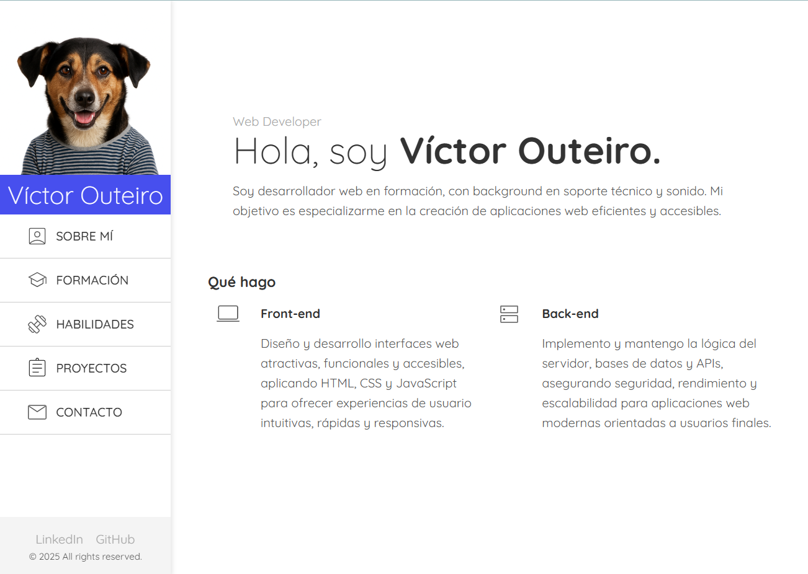

# Personal Web CV – Víctor Outeiro

A responsive personal portfolio and CV website built with **HTML, CSS, and JavaScript**.  
This project showcases my background, skills, and projects in a clean and accessible design.

[Live Demo](https://victor-outeiro.vercel.app/)

---

## Screenshot

---

## Table of Contents

- [About](#about)
- [Features](#features)
- [Technologies](#technologies)
- [Lessons Learned](#lessons-learned)
- [Projects](#projects)
- [Contact](#contact)

---

## About

This is my personal CV website, designed to present my professional profile, education, skills, and portfolio projects.  
It is fully responsive, adapting smoothly from mobile to desktop layouts.

---

## Features

- Responsive sidebar navigation (mobile & desktop).
- Multiple sections: About, Education, Skills, Projects, Contact.
- Contact form powered by **Formspree**.
- Embedded **Google Maps** for location.
- Download CV button and social media links.

---

## Technologies

- **HTML5** for semantic structure.
- **CSS3** with:
  - Variables for theming.
  - Flexbox and Grid layouts.
  - Media queries for responsive design.
- **JavaScript** for interactivity (menu toggle).
- **Formspree** for handling form submissions.

---

## Lessons Learned

While building this project, I improved my skills in:

- Complex **CSS usage** for real-world layouts.
- Mastering **Grid** and **Flexbox** combinations.
- Implementing **responsive design** with media queries.
- Using **CSS variables** for consistent theming.

---

## Projects

The website showcases some of my personal and practice projects, such as:

- Weather app.
- ToDo List app.
- Recipe app.
- Personal website mockup.
- Crowdfunding product page.

---

## Contact

- **Location**: Seville, Spain
- **Phone**: +34 675 53 41 38
- **Email**: victor_outeiro@hotmail.com
- **LinkedIn**: [linkedin.com/in/victor-outeiro](https://www.linkedin.com/in/victor-outeiro/)
- **GitHub**: [github.com/Radu-A](https://github.com/Radu-A)

---

© 2025 Víctor Outeiro. All rights reserved.
